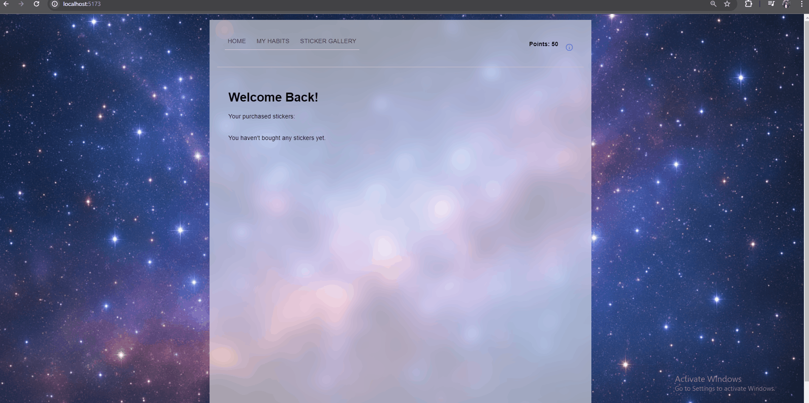

# [Beam]

CodePath WEB103 Final Project

Designed and developed by: [Kristal Hong, Luis Pina, Noelle Garrick]

🔗 Link to deployed app:

## About

### Description and Purpose

Beam is a gamified habit and task tracker that visualizes progress in a fun and interactive way. As users complete tasks, they earn points that can be spent to customize an in-game creature or environment. Visual feedback, rewards, and customization motivate consistent task completion while allowing users to track their achievements over time.
The purpose of Beam is to help users build consistent, healthy habits through gamification and visual progress. By tying task completion to rewards, customization, and visual feedback, the app encourages focus, accountability, and satisfaction. 

### Inspiration

Habit tracking apps with a visual representation of progress – examples include “Plant Nanny”, an app that lets you track you water consumption and use it to water virtual plants, and  “Finch,” where checking off to-do list items earns points you can spend on accessories for your in-game pet.

## Tech Stack

Frontend: React.js

Backend: Render, Postgresql

## Features

### View and manage your habits

This feature allows for users to create,edit, delete, and organize their habits by putting different tags to be able to filter what habit is associate with what aspect of life they are trying to improve.

### Start a timer for habit sessions

This feature allows for users to set their own timer to be able to get points to spend in the store, it will increase their current score and recieve 1 point per minute focused.

### Sticker Store

This feature allows to use their points earned to be able to purchase items and from there it will reduce their points or give them a notifcation that shows them they have insufficent funds

### [ADDITIONAL FEATURES GO HERE - ADD ALL FEATURES HERE IN THE FORMAT ABOVE; you will check these off and add gifs as you complete them]

## Installation Instructions

- First git clone the repo
- Once done npm install inside the client directory
- npm run reset in the server directory
  - npm run start in the server directory
- npm run dev in client directory
